# DEHRL

This repository provides implementation of [**domains**](#domains), [**DEHRL**](#setup-an-environment-to-run-our-code) and [**results visualization**](#results-visualization) for paper:

* **Diversity−Driven Extensible Hierarchical Reinforcement Learning.**
[*Yuhang Song*](http://www.cs.ox.ac.uk/people/yuhang.song/),
[*Jianyi Wang* &#8224;](http://45.77.201.133/html/Members/jianyiwang.html),
[*Thomas Lukasiewicz* &#8727;](http://www.cs.ox.ac.uk/people/thomas.lukasiewicz/),
[*Zhenghua Xu* &#8727;](https://www.cs.ox.ac.uk/people/zhenghua.xu/),
[*Mai Xu*](http://45.77.201.133/html/Members/maixu.html).
Co-first author&#8224;.
Corresponding author&#8727;.
[[Paper](https://www.dropbox.com/s/zt8wwwyy80f8b3q/Song.pdf?dl=0)],
[[Supplementary Material](https://www.dropbox.com/s/0viej0541ns7o3i/main.pdf?dl=0)].

Published on [**Proceedings of the 33rd National Conference on Artificial Intelligence (AAAI 2019)**](https://www.computer.org/web/tpami).
By [Intelligent Systems Lab](http://www.cs.ox.ac.uk/people/thomas.lukasiewicz/isg-index.html) @ [Computer Science](http://www.cs.ox.ac.uk/) in [University of Oxford](http://www.ox.ac.uk/).

<p align="center"></p>

Specifically, this repository includes simple guidelines to:
* [Use the domains](#domains).
* [Setup a environment and run DEHRL.](#setup-an-environment-and-run-dehrl)
* [Reproduce visualization from the paper.](#results-visualization)

If you find our code or paper useful for your research, please cite:
```
@inproceedings{SWLXX-AAAI-2019,
  title = "Diversity-Driven Extensible Hierarchical Reinforcement Learning",
  author = "Yuhang Song and Jianyi Wang and Thomas Lukasiewicz and Zhenghua Xu and Mai Xu",
  year = "2019",
  booktitle = "Proceedings of the 33rd National Conference on Artificial Intelligence‚ AAAI 2019‚ Honolulu, Hawaii, USA‚ January 27 - February 1‚ 2019",
  month = "January",
  publisher = "AAAI Press",
}
```

Note that the project is based on an [RL implemention by Ilya Kostrikov](https://github.com/ikostrikov/pytorch-a2c-ppo-acktr), we thank a lot for his contribution to the community.

## Domains

All domains share the same interface as [OpenAI Gym](https://github.com/openai/gym).
See ```overcooked.py```, ```minecraft.py```, ```gridworld.py``` for more details.
Note that MineCraft is based on [the implemention by Michael Fogleman](https://github.com/fogleman/Minecraft), we thank a lot for his contribution to the community.
Besides, be aware that MineCraft only supports single thread training and it requires the xserver.

## Setup an environment and run DEHRL

In order to install requirements, follow:

```bash
# create env
conda create -n dehrl

# source in env
source ~/.bashrc
source activate dehrl

conda install pytorch torchvision -c soumith
pip install opencv-contrib-python
conda install scikit-image
pip install --upgrade imutils

mkdir dehrl
cd dehrl
git clone https://github.com/YuhangSong/DEHRL.git
mkdir results
```

Run commands here to enter the virtual environment before proceeding to following commands:
```bash
source ~/.bashrc
source activate dehrl
```

### Run OverCooked

The domain is somehow inspired by a game in the same name (though significantly different and coded by ourselves):

<p align="center"></p>

We thank them a lot for this inspiration.

#### Level: 1

Goal-type: any.
```bash
CUDA_VISIBLE_DEVICES=0 python main.py --algo ppo --use-gae --lr 2.5e-4 --clip-param 0.1 --value-loss-coef 1 --num-processes 8 --actor-critic-mini-batch-size 256 --actor-critic-epoch 4 --exp code_release --obs-type 'image' --env-name "OverCooked" --reward-level 1 --setup-goal any --new-overcooked --num-hierarchy 2 --num-subpolicy 5 --hierarchy-interval 4 --num-steps 128 128 --reward-bounty 0.1875 --distance mass_center --transition-model-mini-batch-size 64 --train-mode together --clip-reward-bounty --clip-reward-bounty-active-function linear --log-behavior-interval 5 --aux r_0
```

Goal-type: fix
```bash
CUDA_VISIBLE_DEVICES=0 python main.py --algo ppo --use-gae --lr 2.5e-4 --clip-param 0.1 --value-loss-coef 1 --num-processes 8 --actor-critic-mini-batch-size 256 --actor-critic-epoch 4 --exp code_release --obs-type 'image' --env-name "OverCooked" --reward-level 1 --setup-goal fix --new-overcooked --num-hierarchy 2 --num-subpolicy 5 --hierarchy-interval 4 --num-steps 128 128 --reward-bounty 0.1875 --distance mass_center --transition-model-mini-batch-size 64 --train-mode together --clip-reward-bounty --clip-reward-bounty-active-function linear --log-behavior-interval 5 --aux r_0
```

Goal-type: random
```bash
CUDA_VISIBLE_DEVICES=0 python main.py --algo ppo --use-gae --lr 2.5e-4 --clip-param 0.1 --value-loss-coef 1 --num-processes 8 --actor-critic-mini-batch-size 256 --actor-critic-epoch 4 --exp code_release --obs-type 'image' --env-name "OverCooked" --reward-level 1 --setup-goal random --new-overcooked --num-hierarchy 2 --num-subpolicy 5 --hierarchy-interval 4 --num-steps 128 128 --reward-bounty 0.1875 --distance mass_center --transition-model-mini-batch-size 64 --train-mode together --clip-reward-bounty --clip-reward-bounty-active-function linear --log-behavior-interval 5 --aux r_0
```

#### Level 2

Goal-type: any
```bash
CUDA_VISIBLE_DEVICES=0 python main.py --algo ppo --use-gae --lr 2.5e-4 --clip-param 0.1 --value-loss-coef 1 --num-processes 8 --actor-critic-mini-batch-size 256 --actor-critic-epoch 4 --exp code_release --obs-type 'image' --env-name "OverCooked" --reward-level 2 --setup-goal any --new-overcooked --num-hierarchy 3 --num-subpolicy 5 5 --hierarchy-interval 4 12 --num-steps 128 128 128 --reward-bounty 1 --distance mass_center --transition-model-mini-batch-size 64 64 --train-mode together --clip-reward-bounty --clip-reward-bounty-active-function linear --log-behavior-interval 5 --aux r_0
```

Goal-type: fix
```bash
CUDA_VISIBLE_DEVICES=0 python main.py --algo ppo --use-gae --lr 2.5e-4 --clip-param 0.1 --value-loss-coef 1 --num-processes 8 --actor-critic-mini-batch-size 256 --actor-critic-epoch 4 --exp code_release --obs-type 'image' --env-name "OverCooked" --reward-level 2 --setup-goal fix --new-overcooked --num-hierarchy 3 --num-subpolicy 5 5 --hierarchy-interval 4 12 --num-steps 128 128 128 --reward-bounty 1 --distance mass_center --transition-model-mini-batch-size 64 64 --train-mode together --clip-reward-bounty --clip-reward-bounty-active-function linear --log-behavior-interval 5 --aux r_0
```

Goal-type: random
```bash
CUDA_VISIBLE_DEVICES=0 python main.py --algo ppo --use-gae --lr 2.5e-4 --clip-param 0.1 --value-loss-coef 1 --num-processes 8 --actor-critic-mini-batch-size 256 --actor-critic-epoch 4 --exp code_release --obs-type 'image' --env-name "OverCooked" --reward-level 2 --setup-goal random --new-overcooked --num-hierarchy 3 --num-subpolicy 5 5 --hierarchy-interval 4 12 --num-steps 128 128 128 --reward-bounty 1 --distance mass_center --transition-model-mini-batch-size 64 64 --train-mode together --clip-reward-bounty --clip-reward-bounty-active-function linear --log-behavior-interval 5 --aux r_0
```

Following curves are produced at commit point ```7ea3aec9eabcd421d5660042d3e50333454f928e```.

Level 1; Any | Level 1; Fix | Level 1; Random
:-------------------------:|:-------------------------:|:-------------------------:
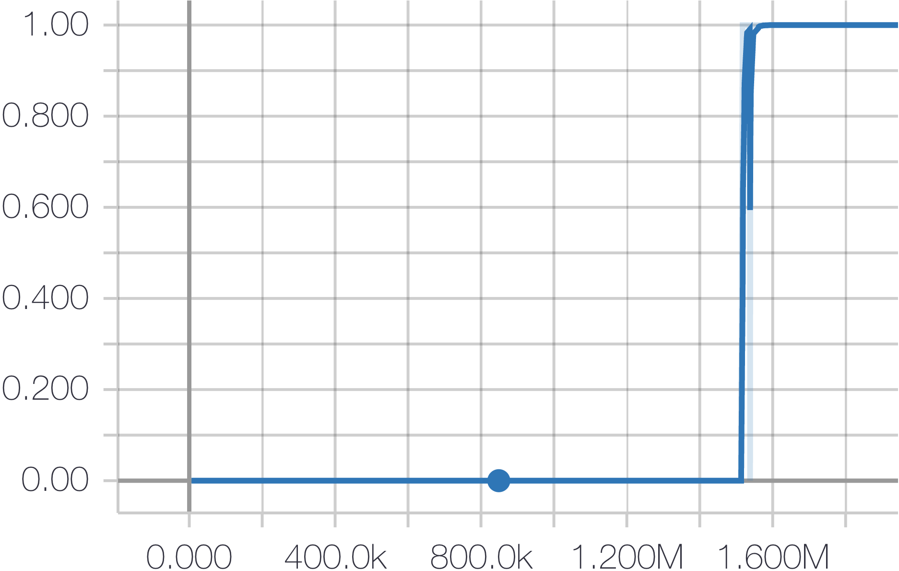  |  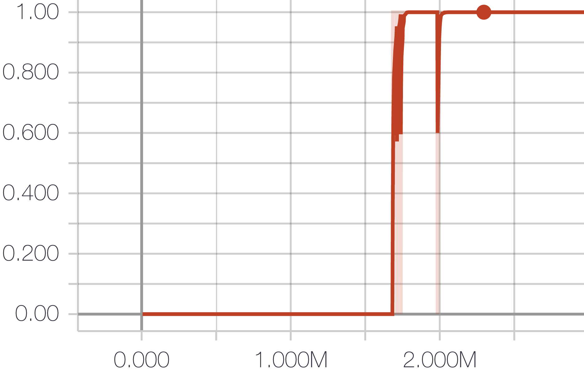  |  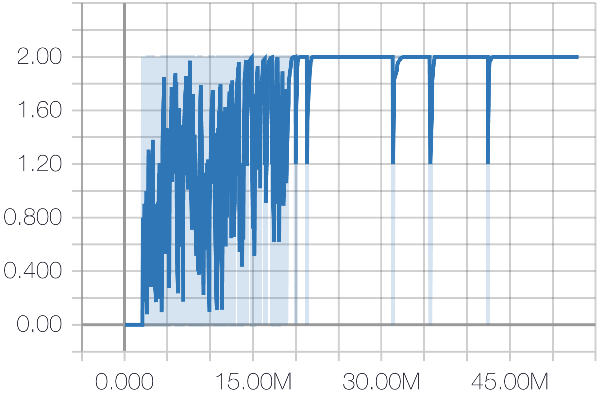
Level 2; Any | Level 2; Fix | Level 2; Random
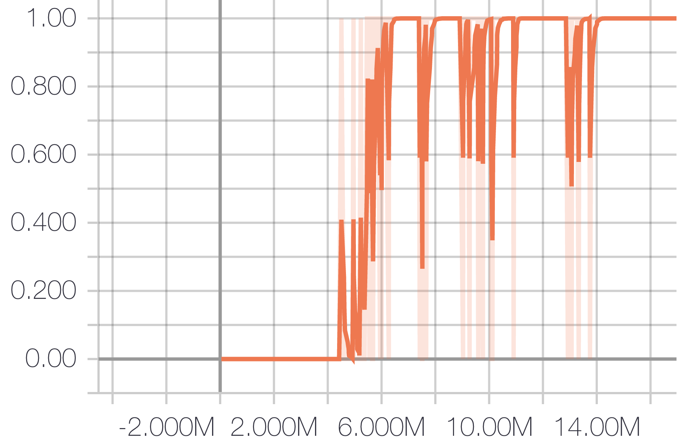  |  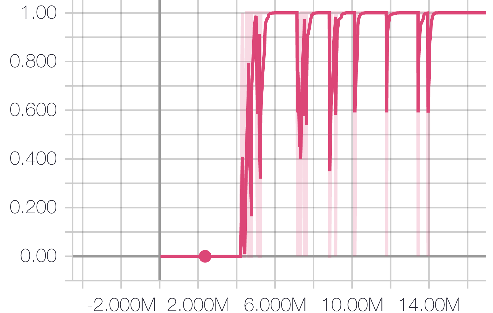  |  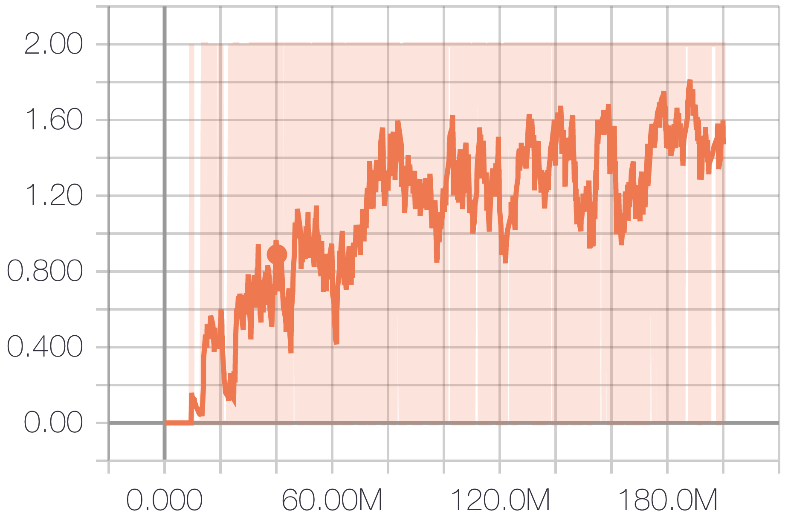

If you cannot reproduce above curves, checkout to above points and run following commands again.
In the mean time, open an issue immediately, since we believe we are introducing unintentional changes to the code when adding more domains to present.

#### Load pre-trained model and data

The code antomatically check and reload everything from the log dir you set, and everything (model/curves/videos, etc.) is saved every 10 minutes.
Thus, please feel free to continue your experiment from where you stopped by simply typing in the same command.

If you want to load our pre-trained model, download the zipped log dir from [here]() and unzip it to the ```../results/``` dir.
Then run the same commands to load our model as well as other training data.

### Run MineCraft

```bash
CUDA_VISIBLE_DEVICES=0 python main.py --algo ppo --use-gae --lr 2.5e-4 --clip-param 0.1 --value-loss-coef 1 --num-processes 1 --actor-critic-mini-batch-size 256 --actor-critic-epoch 4 --exp code_release --obs-type 'image' --env-name "MineCraft" --num-hierarchy 4 --num-subpolicy 8 8 8 --hierarchy-interval 4 4 4 --num-steps 128 128 128 128 --reward-bounty 1 --distance l1 --transition-model-mini-batch-size 64 64 64 --train-mode together --clip-reward-bounty --clip-reward-bounty-active-function linear --log-behavior-interval 10 --aux r_0
```

<p align="center"></p>

We also save the world build by the agent, set
```
window.loadWorld('<path-to-the-save-file>.sav')
```
to the path of ```.sav``` file and run
```
python replay.py
```
to have a third person view of the built world.

<p align="center"></p>

### Run Atari

#### Game: MontezumaRevengeNoFrameskip-v4

The agent can reach the key when the skull is not presented, video is [here](https://www.dropbox.com/s/abcjmzxu9eubcbd/H-0_F-67778560_observation.avi?dl=0).
```bash
CUDA_VISIBLE_DEVICES=0 python main.py --algo ppo --use-gae --lr 2.5e-4 --clip-param 0.1 --value-loss-coef 1 --num-processes 8 --actor-critic-mini-batch-size 256 --actor-critic-epoch 4 --exp code_release --obs-type 'image' --env-name "MontezumaRevengeNoFrameskip-v4" --num-hierarchy 3 --num-subpolicy 5 5 --hierarchy-interval 8 4 --num-steps 128 128 128 --reward-bounty 1 --distance mass_center --transition-model-mini-batch-size 64 64 --train-mode together --clip-reward-bounty --clip-reward-bounty-active-function linear --log-behavior-interval 5 --aux r_0
```
But due to the skull is affecting the mass centre of the state significantly, our method fails when the skull is moving in the state.
Necessary solution is to generate a mask that can locate the part of the state that is controlled by the agent.
Luckily, [a recent paper under review by ICLR 2019](https://www.dropbox.com/s/mftt1ll0q39dalz/File%202018-10-7%2C%209%2036%2022%20AM.pdf?dl=0) solves this problem.
But their code is not released yet, so we implement their idea to generate the mask.

However, their idea works ideally on simple domain like GridWorld.
Run following command to see the learnt masks on GridWorld,
```bash
CUDA_VISIBLE_DEVICES=0 python main.py --algo ppo --use-gae --lr 2.5e-4 --clip-param 0.1 --value-loss-coef 1 --num-processes 8 --actor-critic-mini-batch-size 256 --actor-critic-epoch 4 --exp code_release --obs-type 'image' --env-name "GridWorld" --num-hierarchy 2 --num-subpolicy 5 --hierarchy-interval 4 --num-steps 128 128 --reward-bounty 1 --distance mass_center --transition-model-mini-batch-size 64 --inverse-mask --num-grid 7 --train-mode together --clip-reward-bounty --clip-reward-bounty-active-function linear --log-behavior-interval 5 --aux r_0
```
Following video is produced at commit point ```04baecee316234a7f3fdcd51d1908c971211fdce```.

<p align="center"></p>

If you cannot reproduce above curves, checkout to above points and run following commands again.
In the mean time, open an issue immediately, since we believe we are introducing unintentional changes to the code when adding more domains to present.

But it performs poorly on MontezumaRevenge.
We are waiting for their official release to further advance our DEHRL on domains with uncontrollable objects.

## Continuous Control

### Explore2DContinuous

Number of subpolicies: 4
```bash
CUDA_VISIBLE_DEVICES=0 python main.py --algo ppo --use-gae --lr 3e-4 --clip-param 0.1 --actor-critic-epoch 10 --entropy-coef 0 --value-loss-coef 1 --gamma 0.99 --tau 0.95 --num-processes 8 --actor-critic-mini-batch-size 256 --actor-critic-epoch 4 --exp code_release --obs-type 'image' --env-name "Explore2DContinuous" --episode-length-limit 32 --num-hierarchy 2 --num-subpolicy 4 --hierarchy-interval 4 --num-steps 128 128 --reward-bounty 1 --distance l2 --transition-model-mini-batch-size 64 --train-mode together --clip-reward-bounty --clip-reward-bounty-active-function linear --log-behavior-interval 5 --aux r_0 --log-behavior
```

Number of subpolicies: 8
```bash
CUDA_VISIBLE_DEVICES=0 python main.py --algo ppo --use-gae --lr 3e-4 --clip-param 0.1 --actor-critic-epoch 10 --entropy-coef 0 --value-loss-coef 1 --gamma 0.99 --tau 0.95 --num-processes 8 --actor-critic-mini-batch-size 256 --actor-critic-epoch 4 --exp code_release --obs-type 'image' --env-name "Explore2DContinuous" --episode-length-limit 32 --num-hierarchy 2 --num-subpolicy 8 --hierarchy-interval 4 --num-steps 128 128 --reward-bounty 1 --distance l2 --transition-model-mini-batch-size 64 --train-mode together --clip-reward-bounty --clip-reward-bounty-active-function linear --log-behavior-interval 5 --aux r_0 --log-behavior
```

Number of subpolicies: 4 | Number of subpolicies: 8 |
:-------------------------:|:-------------------------:
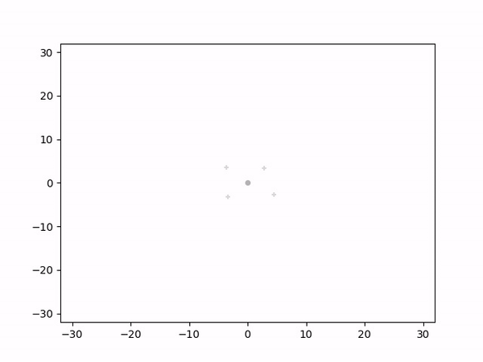  |  

where the dot is current position and crosses are resulted states of different subpolicies.

### PyBullet

[Pybullet](https://pybullet.org/wordpress/) is a free alternative for Mujoco, with even better / more complex continuous control tasks.
Install by ```pip install -U pybullet```.

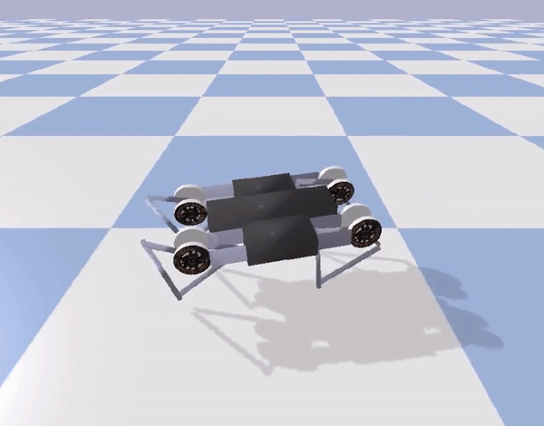  |    |  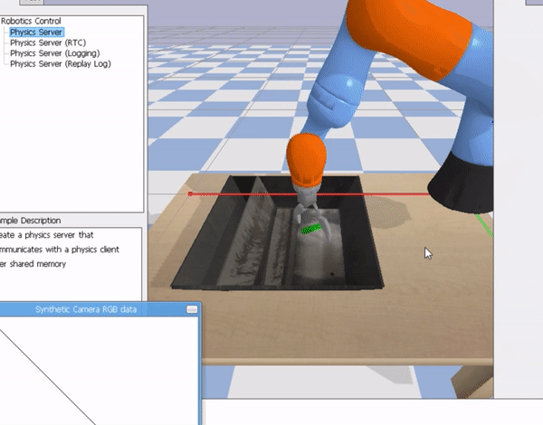  |  
:-------------------------:|:-------------------------:|:-------------------------:|:-------------------------:

#### AntBulletEnv-v0.

Number of subpolicies: 4
```bash
CUDA_VISIBLE_DEVICES=0 python main.py --algo ppo --use-gae --lr 3e-4 --clip-param 0.1 --actor-critic-epoch 10 --entropy-coef 0 --value-loss-coef 1 --gamma 0.99 --tau 0.95 --num-processes 8 --actor-critic-mini-batch-size 256 --actor-critic-epoch 4 --exp AntBulletEnv-0 --obs-type 'image' --env-name "AntBulletEnv-v1" --num-hierarchy 2 --num-subpolicy 4 --hierarchy-interval 32 --num-steps 128 128 --reward-bounty 1 --distance l2 --transition-model-mini-batch-size 64 --train-mode together --unmask-value-function --clip-reward-bounty --clip-reward-bounty-active-function linear --summarize-behavior-interval 15 --aux r_0 --summarize-rendered-behavior --summarize-state-prediction
```

<!-- Number of subpolicies: 2 | Number of subpolicies: 4 |
:-------------------------:|:-------------------------:
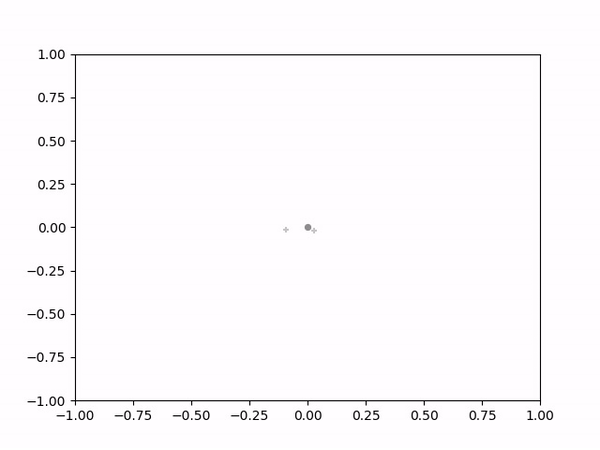  |  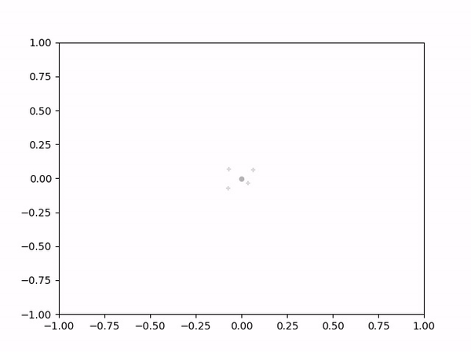 -->

where the dot is current position and crosses are resulted states of different subpolicies.

Note that for above PyBullet domains
* We manually extract position information from observation, and use it to do diverse-driven. This is due to we leave extracting useful information from observation as a future work, and mainly focus on verifying our diverse-drive solution.
* We remove the reward returned by the original enviriment so that the experiment is aimed to let DEHRL discover diverse subpolicies in an unsupervise manner. Of course extrinsic reward can be included, but the goal set out by current environment is too simply to show the effectiveness of diverse sub-policies.
* Thus, the part of experiment is only to show our method scale well to continuous control tasks, futher investigation is a promising future work.

Other available environments in PyBullet can be found [here](https://github.com/bulletphysics/bullet3/blob/master/examples/pybullet/gym/pybullet_envs/__init__.py).

## Run Explore2D

Following results on Explore2D are produced at ```9c2c8bbe5a8e18df21fbda1183e3e2a229a340d1```.

Random policy baseline
```bash
CUDA_VISIBLE_DEVICES=0 python main.py --algo ppo --use-gae --lr 2.5e-4 --clip-param 0.1 --value-loss-coef 1 --num-processes 8 --actor-critic-mini-batch-size 256 --actor-critic-epoch 4 --exp 2d_explore --obs-type 'image' --env-name "Explore2D" --episode-length-limit 1024 --num-hierarchy 2 --num-subpolicy 5 --hierarchy-interval 4 --num-steps 128 128 --reward-bounty 0 --distance l2 --transition-model-mini-batch-size 64 --train-mode together --clip-reward-bounty --clip-reward-bounty-active-function linear --log-behavior-interval 5 --aux r_0
```

### Run with 5 subpolicies

Number of levels: 2
```bash
CUDA_VISIBLE_DEVICES=0 python main.py --algo ppo --use-gae --lr 2.5e-4 --clip-param 0.1 --value-loss-coef 1 --num-processes 8 --actor-critic-mini-batch-size 256 --actor-critic-epoch 4 --exp 2d_explore --obs-type 'image' --env-name "Explore2D" --episode-length-limit 1024 --num-hierarchy 2 --num-subpolicy 5 --hierarchy-interval 4 --num-steps 128 128 --reward-bounty 1 --distance l2 --transition-model-mini-batch-size 64 --train-mode together --clip-reward-bounty --clip-reward-bounty-active-function linear --log-behavior-interval 5 --aux r_0
```

Number of levels: 3
```bash
CUDA_VISIBLE_DEVICES=0 python main.py --algo ppo --use-gae --lr 2.5e-4 --clip-param 0.1 --value-loss-coef 1 --num-processes 8 --actor-critic-mini-batch-size 256 --actor-critic-epoch 4 --exp 2d_explore --obs-type 'image' --env-name "Explore2D" --episode-length-limit 1024 --num-hierarchy 3 --num-subpolicy 5 5 --hierarchy-interval 4 4 --num-steps 128 128 128 --reward-bounty 1 --distance l2 --transition-model-mini-batch-size 64 64 --train-mode together --clip-reward-bounty --clip-reward-bounty-active-function linear --log-behavior-interval 5 --aux r_0
```

Number of levels: 4
```bash
CUDA_VISIBLE_DEVICES=0 python main.py --algo ppo --use-gae --lr 2.5e-4 --clip-param 0.1 --value-loss-coef 1 --num-processes 8 --actor-critic-mini-batch-size 256 --actor-critic-epoch 4 --exp 2d_explore --obs-type 'image' --env-name "Explore2D" --episode-length-limit 1024 --num-hierarchy 4 --num-subpolicy 5 5 5 --hierarchy-interval 4 4 4 --num-steps 128 128 128 128 --reward-bounty 1 --distance l2 --transition-model-mini-batch-size 64 64 64 --train-mode together --clip-reward-bounty --clip-reward-bounty-active-function linear --log-behavior-interval 5 --aux r_0
```

Visualize Explore2D: replace ```main.py``` to ```vis_explore2d.py``` in corresponding command.

Level 1 | Level 2 | Level 3 | Level 4
:-------------------------:|:-------------------------:|:-------------------------:|:-------------------------:
  |  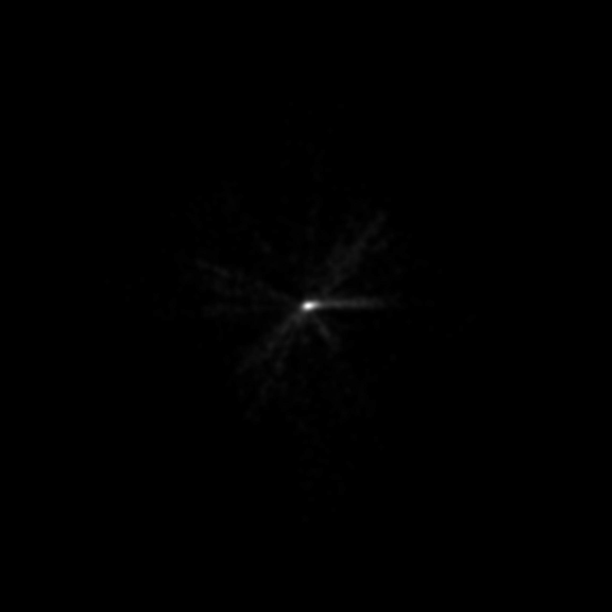  |  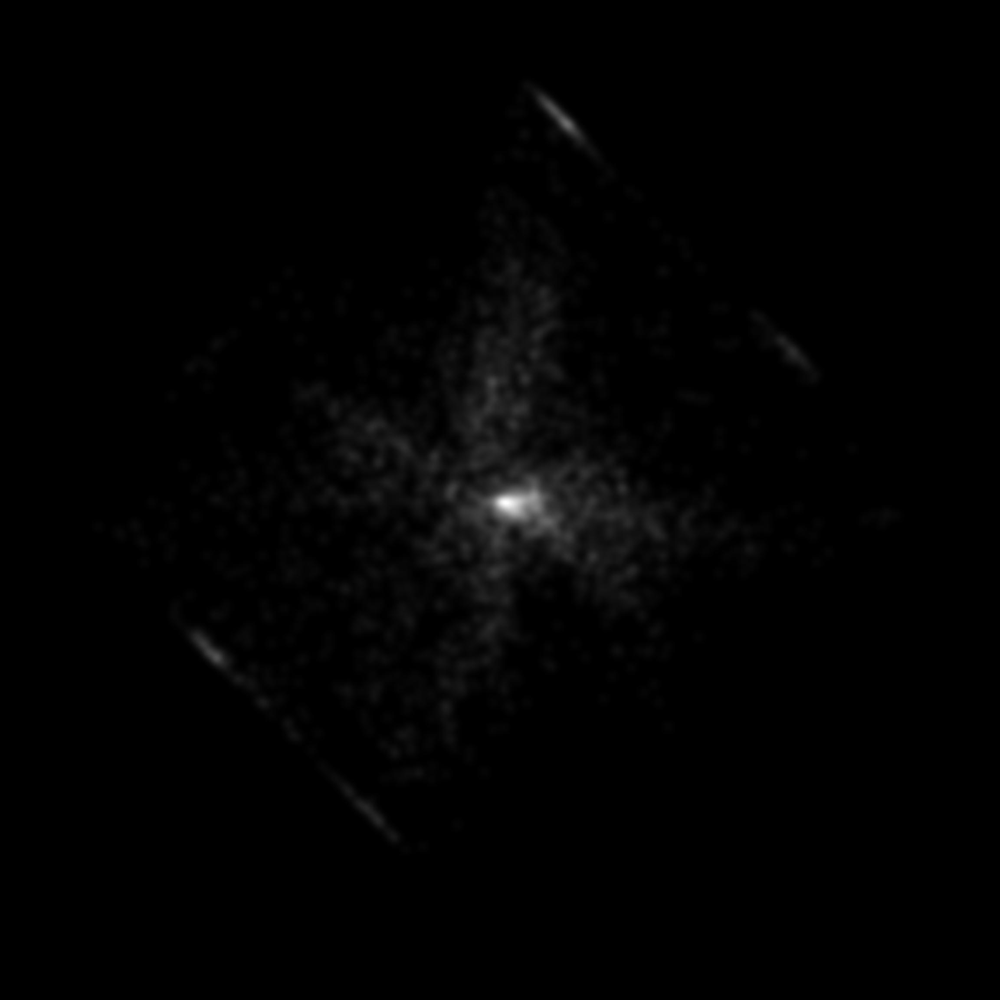  |  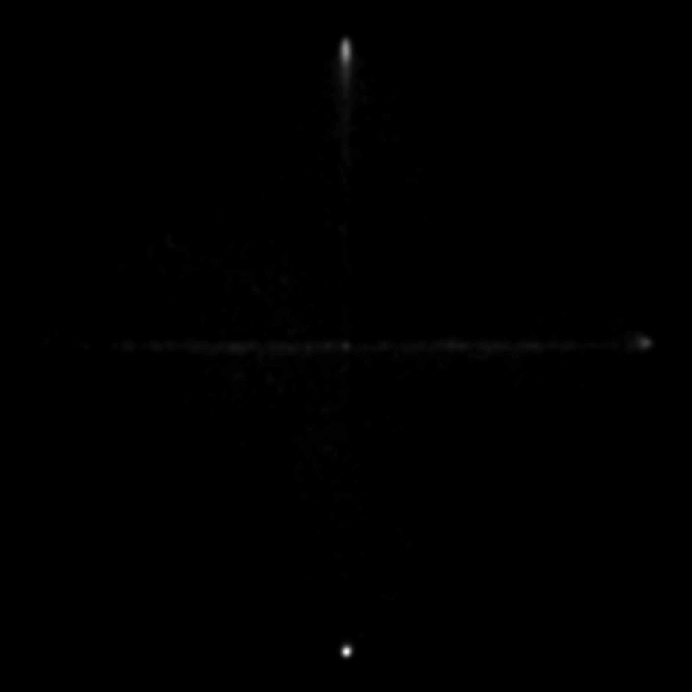

### Run with 9 subpolicies

Number of levels: 2
```bash
CUDA_VISIBLE_DEVICES=0 python main.py --algo ppo --use-gae --lr 2.5e-4 --clip-param 0.1 --value-loss-coef 1 --num-processes 8 --actor-critic-mini-batch-size 256 --actor-critic-epoch 4 --exp 2d_explore --obs-type 'image' --env-name "Explore2D" --episode-length-limit 1024 --num-hierarchy 2 --num-subpolicy 9 --hierarchy-interval 4 --num-steps 128 128 --reward-bounty 1 --distance l2 --transition-model-mini-batch-size 64 --train-mode together --clip-reward-bounty --clip-reward-bounty-active-function linear --log-behavior-interval 5 --aux r_0
```

Number of levels: 3
```bash
CUDA_VISIBLE_DEVICES=0 python main.py --algo ppo --use-gae --lr 2.5e-4 --clip-param 0.1 --value-loss-coef 1 --num-processes 8 --actor-critic-mini-batch-size 256 --actor-critic-epoch 4 --exp 2d_explore --obs-type 'image' --env-name "Explore2D" --episode-length-limit 1024 --num-hierarchy 3 --num-subpolicy 9 9 --hierarchy-interval 4 4 --num-steps 128 128 128 --reward-bounty 1 --distance l2 --transition-model-mini-batch-size 64 64 --train-mode together --clip-reward-bounty --clip-reward-bounty-active-function linear --log-behavior-interval 5 --aux r_0
```

Number of levels: 4
```bash
CUDA_VISIBLE_DEVICES=0 python main.py --algo ppo --use-gae --lr 2.5e-4 --clip-param 0.1 --value-loss-coef 1 --num-processes 8 --actor-critic-mini-batch-size 256 --actor-critic-epoch 4 --exp 2d_explore --obs-type 'image' --env-name "Explore2D" --episode-length-limit 1024 --num-hierarchy 4 --num-subpolicy 9 9 9 --hierarchy-interval 4 4 4 --num-steps 128 128 128 128 --reward-bounty 1 --distance l2 --transition-model-mini-batch-size 64 64 64 --train-mode together --clip-reward-bounty --clip-reward-bounty-active-function linear --log-behavior-interval 5 --aux r_0
```

Level 1 | Level 2 | Level 3 | Level 4
:-------------------------:|:-------------------------:|:-------------------------:|:-------------------------:
  |    |  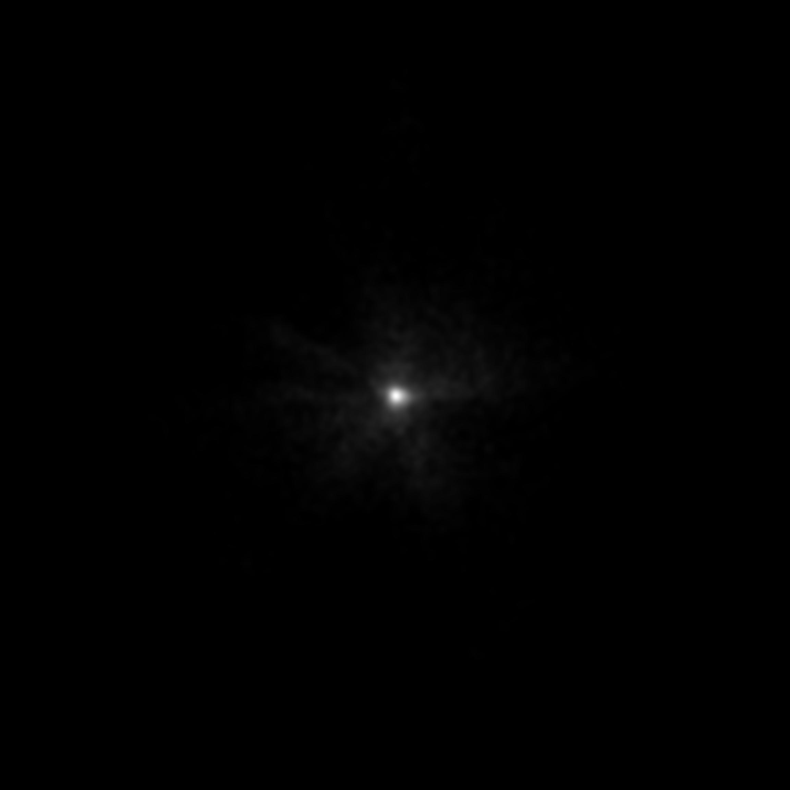  |  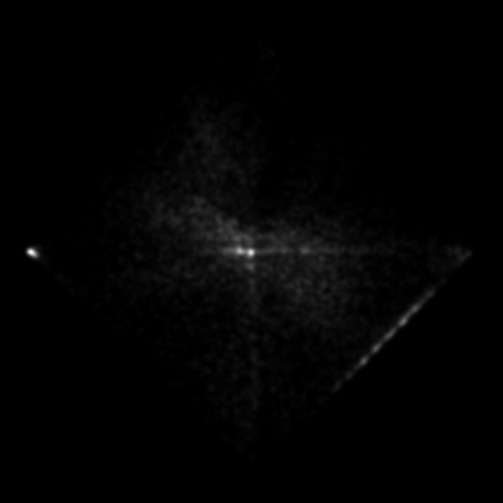

## Results Visualization

The code log multiple curves to help analysis the training process, run:
```
tensorboard --logdir ../results/code_release/ --port 6009
```
and visit ```http://localhost:6009``` for visualization with tensorboard.

<p align="center"></p>

Besides, if you add argument ```--log-behavior```, multiple videos are saved in the logdir.
However, this will cost extra memory, so be careful when you are using it.

<p align="center"></p>

## Meet some problems?

Please feel free to contact us or open an issue (or a pull request if you already solve it, cheers!), we will keep tracking of the issues and updating the code.

Hope you have fun with our work!
